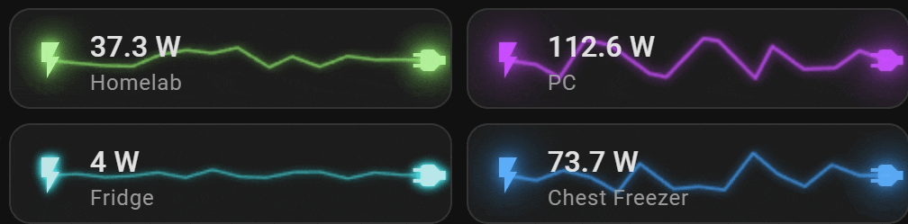
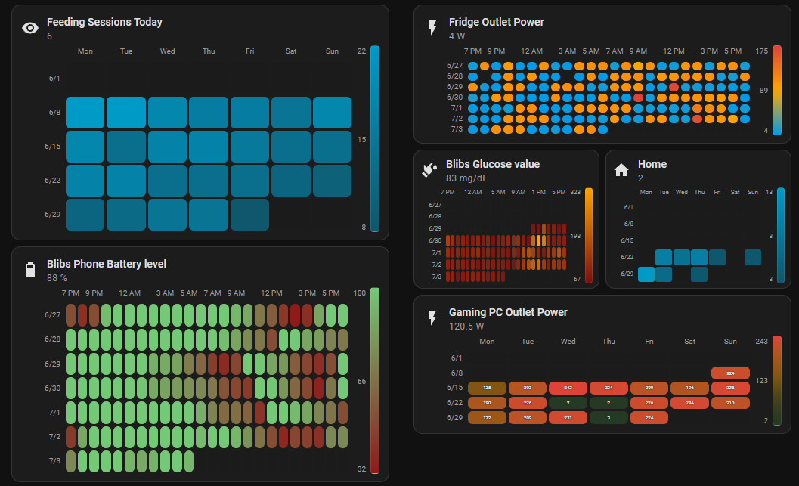
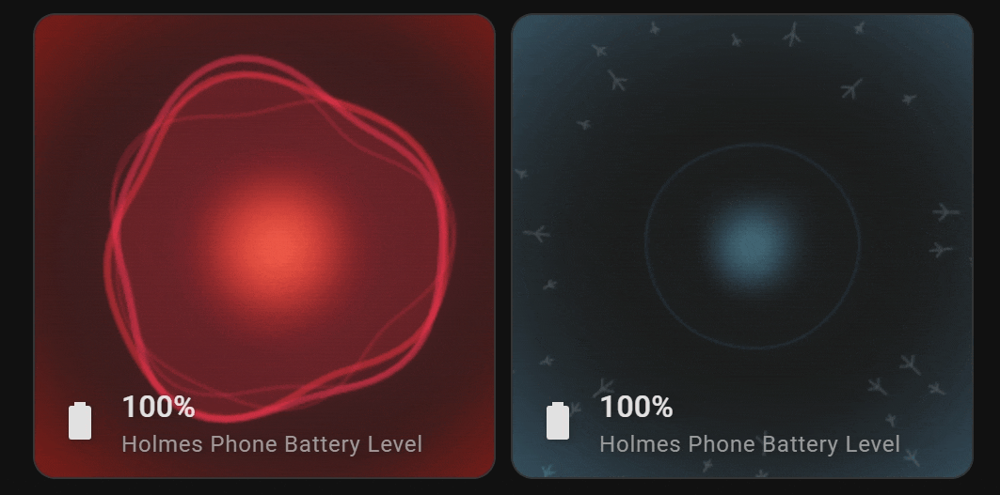
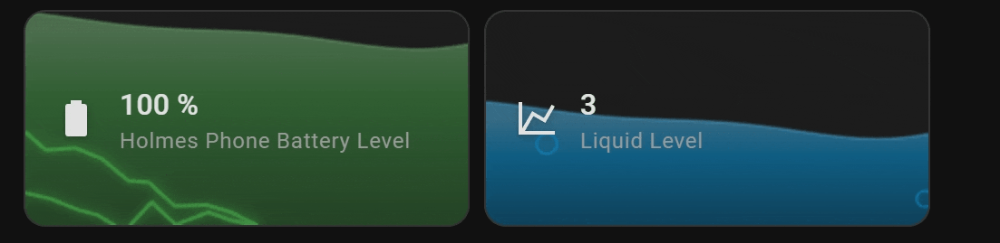
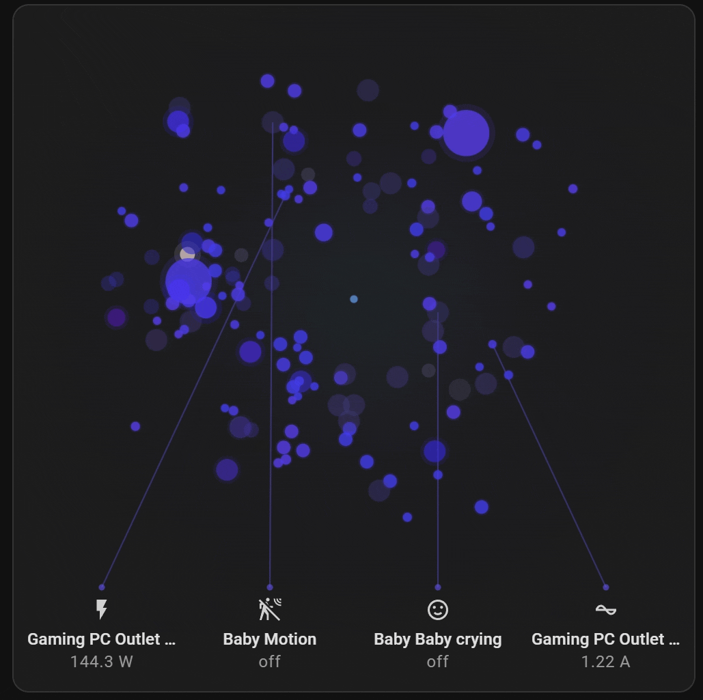
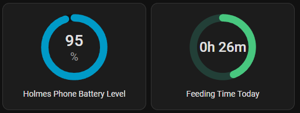
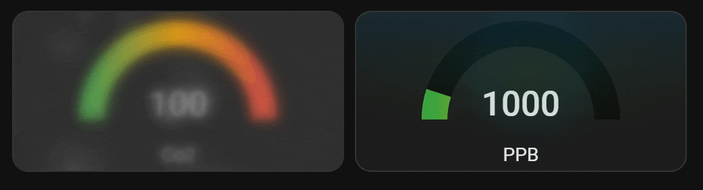

## Overview

Home Assistant collects a lot of data but doesn't do much to present it. The built-in cards are functional, and a dashboard full of them reads like a spreadsheet.

Nvision is a collection of custom lovelace cards designed around visual presentation. Every card is theme-aware, built on Home Assistant's native web components, and fully configurable from the visual editor, so no YAML is required.

## The cards

### Waveform

Live power draw rendered as a glowing waveform, colored per device. The shape of the wave shows whether a PC is idling or under load without reading any numbers.

### Heat map

A temporal heat map for any numeric sensor, laid out like a GitHub contribution graph: hours across, days down, color for intensity. It surfaces patterns a line graph hides, like when the fridge compressor kicks on each day.

### Reactor

An ambient orb that pulses based on a sensor's value. It's meant for reading state from across the room rather than showing a precise number.

### Liquid

A fill gauge rendered as animated liquid. It works for battery levels, tank levels, or anything expressed as a percentage.

### Entity overview

Every entity in an area becomes a particle in a floating constellation. Active entities glow bigger and brighter, and key sensors are called out below, giving a one-glance summary of a room.

### Circle gauge

A circular progress ring for when you just want the number, without the visual noise of the stock gauge.

### Air quality

A gauge tuned for air quality sensors. The scale sweeps from green to red, so the reading is meaningful without memorizing PPB thresholds.

## How it's built

- **HA-native under the hood.** Cards are built from Home Assistant's own elements and theme variables, so they inherit your theme rather than overriding it.
- **Visual editor first.** Every card has a full config editor; nothing requires editing YAML.
- **One template, many cards.** New cards start as a copy of a minimal blank card, which keeps the collection consistent and makes adding a card fast.

## Try it

Nvision installs through [HACS](https://hacs.xyz/) as a custom repository. Add [the repo](https://github.com/iRedSC/nvision), install it, and the cards appear in your dashboard's card picker.
